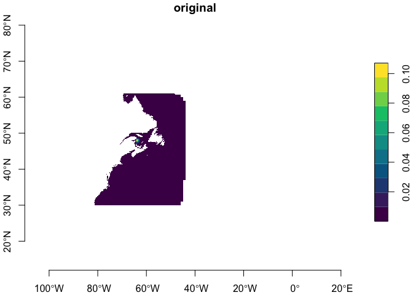
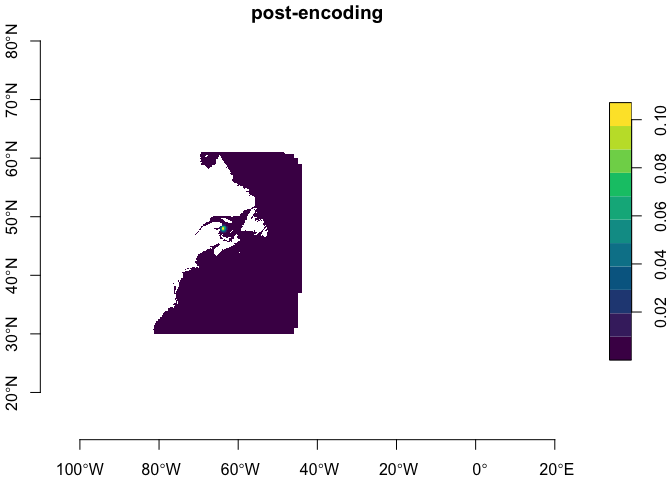

bbmm_io
================

Provides simple tools to reduce the output size of rasters with
extensive **zero** and **NA** regions.

# The original data

First read in an example dataset (that is also the template) and plot
it.

``` r
source("io.R")
orig = read_template(mask = FALSE)
pretty_plot(orig, 
            title = "original", 
            axes = TRUE)
```

    ## downsample set to 3

<!-- -->

# Encoding

Now we encode it which generates a matrix for non-zero and non-NA
pixels. We get back `index`, `lon`, `lat` and `value`.

``` r
e = encode_raster(orig)
head(e)
```

    ##          wix         x        y             
    ## [1,] 1866096 -56.02083 51.85416 8.407791e-45
    ## [2,] 1866097 -55.97917 51.85416 2.802597e-45
    ## [3,] 1866098 -55.93750 51.85416 1.401298e-45
    ## [4,] 1869454 -56.10417 51.81250 6.305843e-44
    ## [5,] 1869455 -56.06250 51.81250 3.082857e-44
    ## [6,] 1869456 -56.02083 51.81250 1.261169e-44

## Or just write it and ignore encoding

We can skip that step by simply calling the encoded writer.

``` r
e = write_encoded(orig, file = "encoded.bin")
```

# Read it back

Now read it back.

``` r
x = read_encoded(file = "encoded.bin")
pretty_plot(x,
            title = "post-encoding",
            axes = TRUE)
```

    ## downsample set to 3

<!-- -->

Well, the seem to be the same.

# Difference

What about the difference? Say `x - orig`?

``` r
d = x[1] - orig[1]
d[[1]] |>
  as.vector() |>
  summary()
```

    ##    Min. 1st Qu.  Median    Mean 3rd Qu.    Max.    NA's 
    ##       0       0       0       0       0       0 4399895
